## Executive Summary:

## Malware Composition:

|FileName|Sha256 Hash|
|---|---|
|Dropper.exe|F853EC1882CB8D69871A40B31B1840DAB24293AEE640E79397E51E870A5EDB68|
|st018231.exe|26b6ed96496cad0ad2a9bb75a39e63977ea091fa43d88fae2a8002bd61f57d39|
|lr080656.exe|7310c28dc6a24530885da07d08c851b4a6c5aa987d2a44ce53cb73e72235fa49|
|93175138.exe|850cd190aaeebcf1505674d97f51756f325e650320eaf76785d954223a9bee38|
|kp392506.exe|979b0cca222ef44ba2fc5d406c3c7cdb1a255748ada55c32db5ee18cad5f54f7|

## Static Analysis:

- **Dropper.exe**

During a search of the binaries strings, several executable files were discovered. 

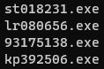

Floss Decoded Strings:

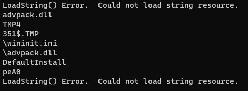

The combination of these Windows APIs suggest that the binary is a Malicious Dropper.

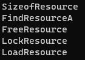

Resource Section is 94% of the file-ratio, providing further confirmation the executable is most likely Dropper Malware.

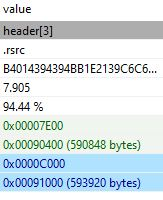

- **st018231.exe**

This executable appears to be very similiar to Dropper. It contains the same Resource API usages but only makes reference to the following executable files:

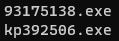

The file is also considerably smaller in size when compared to Dropper. The resource section also contains %92.56 of the file-ratio.

- **lr080656.exe**

This executable appears to be a 32-bit .NET binary with the Network Exfiltration and Data Obfuscation techniques.

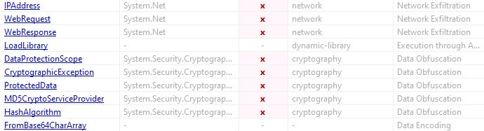

- **93175138.exe**

This executable appears to be a 32-bit .NET binary with several Registry keys making reference to Windows Defender. 

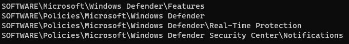

Several Windows APIs indicate Access Token Manipulation and Service Stop techniques. Most likely disabling Windows Anti-Virus.

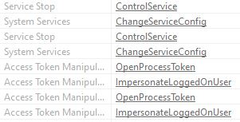

- **kp392506.exe**

The file version contains obivously false information.

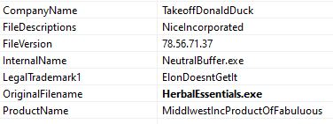

Such as "TakeoffDonaldDuck", "NiceIncorporated", and "ElonDoesntGetIt".

The binary contains File, Process, and Data Collection techniques.

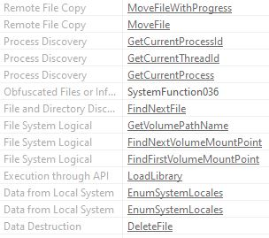

## Dynamic Analysis:
- **Dropper.exe**  
Upon execution of the binary, the files st018231, 93175138, kp392506, and lr080656 are subsquently executed. According to the process tree, st018231 is executed first. Binaries 93175138 and kp392506 are processes created under st018231. The last binary to execute prior to termination of Dropper is lr080656.

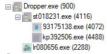

Registry Modifications can be observed to the HKLM (Local Machine) within the "Image File Execution Options" for Dropper, st018231, and lr080656 executables; This is a known persistence technique.

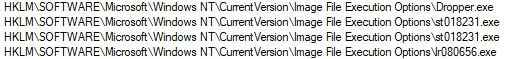

## Code Analysis:

## Indicators of Compromise:

## Yara Rules:

