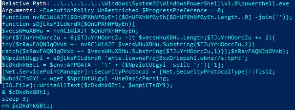

# Summary:  
LNK file obtained from Malware Bazaar. The objective is to practice analyzing a malicious binary/object. The file was renamed to unknown.

## Malware Composition / IOCs  
|File Name|Sha256 Hash|
|---|---|
|unknown.lnk|df4406a46530428037161ec4da37e8c0cc20fb58f772f1c05af031caf1741a84|
|newvice.hta|9cbf1c6d62b4071babeee157a533e97cb7e87a268af1a61ddb3ac7a1b647b39a|
|vice.exe|a3e34d9df2e5ed18ecb2236c44428ecb068bf476767eb482e0812eeb761071fd|
|URL|https[:]//newk1[.]shop|
|C2|https[:]//api[.]telegram[.]org/bot5905114115:AAEtJ13Y8sU1fQgR9KsdZZhYCIQmu7J2ahU/sendMessage?chat_id=5334267822|

The unknown.lnk file contains a PowerShell cmd line:

  
*
Figure #1: LEcmd output
*

The command will reach out to *https[:]//newk1[.]shop/LzDBxdjP/newvice[.]hta*. As part of the script, it will write all text of newvice[.]hta to the file path *C[:]\Users\$env:APPDATA\Roaming\newvice[.]hta*. The last two operations will execute the file *newvice[.]hta* and then delete it after sleeping for 3 seconds.

